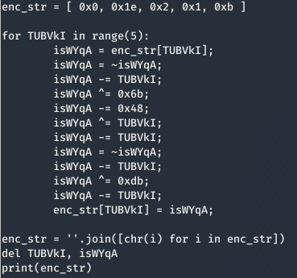

# String-encrypt
[]() []() []()

String encryption parser in Python

Outputs a decryption function for encrypting an inputted string

## Information

- Python 3 compatible

- Encrypts string input with randomized functions

  - i.e. XOR, NEG, ADD, SUB, INC, DEC

  - Increase variability using index of decryption loop

- Supported languages:

  - C/C++
  
  - Python

  - Javascript

  - Java

## Usage

### 

## Example commands

```shell
> ./parser.py -s hello -e 10 -l py -t 3 -o hello.py
```

### 

## References

- [Stringencrypt](https://www.stringencrypt.com)

### Note: Program is made without reference to the executable from the website. The python program here is written from scratch with reference solely to the outputs of the string encryption there
