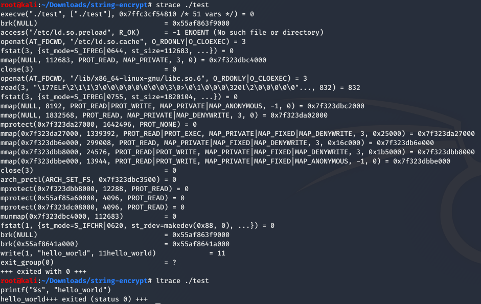
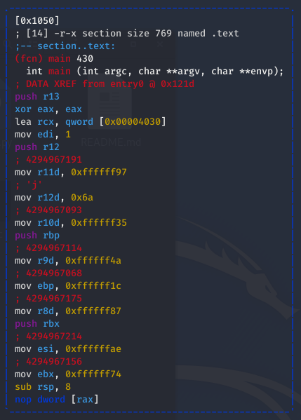
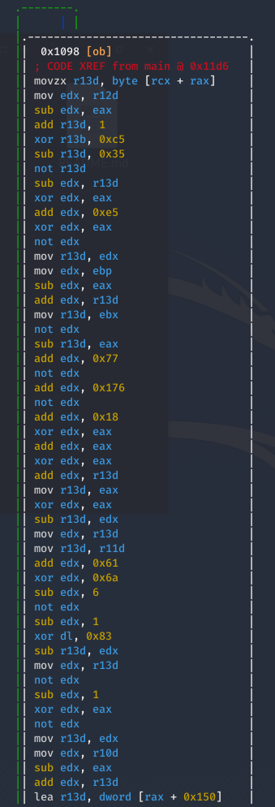
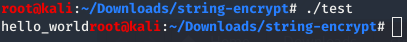

# String-encrypt
[]() []() []()

String encryption parser in Python

Outputs a decryption function for encrypting an inputted string

## Information

- Python 3 compatible

- Encrypts string input with randomized functions

  - i.e. XOR, NEG, ADD, SUB, INC, DEC

  - Increase variability using index of decryption loop

- Supported languages:

  - C/C++

  - Python

  - Javascript

  - Java

## Usage

### 

## Example commands

```shell
> ./parser.py -s hello -e 10 -l py -t 3 -o hello.py
```

### 

## Aim

```shell
> ./parser.py -s hello_world -l C -e 150 -t 100 -o test.c
> gcc -O3 -s -o test test.c
```

Although the encoding algorithm is clearly written in our output similar to the one shown above, there is no trace of our algorithm in the system trace of the running executable

### 

By increasing the number of encoding steps, the complexity of the encoding increases linearly. By using the GCC GNU compiler to further optimize the decoding algorithm as well as stripping the final executable, the executable will be more troublesome to reverse 

The optimization from the GCC `-O3` hugely decreased the initialization of the char array into the ones below

### 

The decoding algorithm can be reversed, but due to the variability and reliance on the index of the decryption loop, the reversing of this loop gets more troublesome

### 

As shown below, the binary does perfectly fine in decoding the char array and printing it in the console

### 

## References

- [Stringencrypt](https://www.stringencrypt.com)

### Note: Program is made without reference to the executable from the website. The python program here is written from scratch with reference solely to the outputs of the string encryption there
